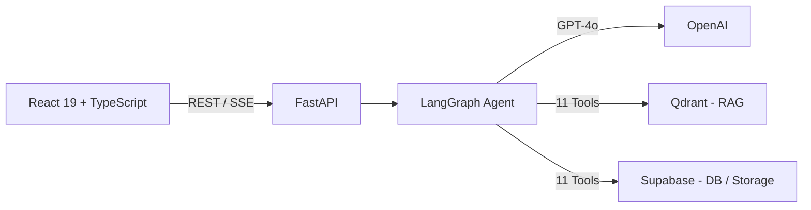

# CaseMate

**AI 기반 법률 사건 관리 플랫폼** — 사건 분석, 판례 검색, 증거 관리를 하나의 AI 어시스턴트로 통합


## 데모

<p align="center">
  
</p>

## 핵심 기능

### AI 법률 어시스턴트
LangGraph 5-Node StateGraph 기반 에이전트가 11개 도구를 활용하여 사용자 질문에 답변합니다.
멀티홉 추론으로 복합 질의를 처리하고, SSE를 통해 도구 실행 과정과 답변을 실시간 스트리밍합니다.

### 판례 검색 & 분석
Qdrant 하이브리드 RAG(Dense + Sparse BM25)로 의미·키워드 검색을 동시 수행합니다.
KURE 한국어 법률 특화 임베딩을 사용하며, 유사 판례 비교 분석 결과를 캐싱하여 중복 LLM 호출을 방지합니다.

### AI 사건 분석
사건 설명서에서 배경·사실관계·쟁점을 자동 추출하고, 타임라인과 인물 관계도를 생성합니다.
분석 결과의 stale 여부를 `description_hash`로 감지하여 데이터 일관성을 유지합니다.

### 증거 관리
이미지(EasyOCR + Vision API), 음성(Whisper STT), PDF(PyMuPDF)에서 텍스트를 자동 추출합니다.
추출된 내용을 사건 맥락과 결합하여 법적 관련성·위험도를 AI가 평가합니다.

## 아키텍처



## 기술 스택

| 영역 | 기술 |
|------|------|
| **Backend** | FastAPI, Python 3.11+, SQLAlchemy, PostgreSQL (Supabase) |
| **Frontend** | React 19, TypeScript, Vite, Tailwind CSS, Radix UI |
| **AI / LLM** | OpenAI GPT-4o-mini, LangGraph, LangChain |
| **Vector DB** | Qdrant (하이브리드 검색: Dense + Sparse) |
| **임베딩** | KURE (HuggingFace Inference API), FastEmbed (BM25) |
| **스토리지** | Supabase Storage |
| **실시간** | Server-Sent Events (SSE) |

## 시작하기

### Backend

```bash
cd backend
python -m venv venv && source venv/bin/activate
pip install -r requirements.txt
uvicorn app.main:app --reload --port 8000
```

### Frontend

```bash
cd frontend
npm install && npm run dev
```

### 환경 변수 (.env)

```
OPENAI_API_KEY
DATABASE_URL
QDRANT_URL
QDRANT_API_KEY
SUPABASE_URL
SUPABASE_ANON_KEY
SUPABASE_SERVICE_ROLE_KEY
JWT_SECRET
HF_API_TOKEN
```

## 팀

| 이름 | 역할 |
|------|------|
| **dayforged** | AI 어시스턴트 (홈 에이전트), AI 사건 분석, 보안/안정성, 프론트엔드 UI/UX |
| **DaHee05** | AI 어시스턴트 (홈 에이전트), 판례 검색/AI 비교 분석, 프론트엔드 UI/UX, AWS 배포 |
| **hdju (kiribati)** | 타임라인, 인물관계도, VLM |

## 라이선스

MIT License
